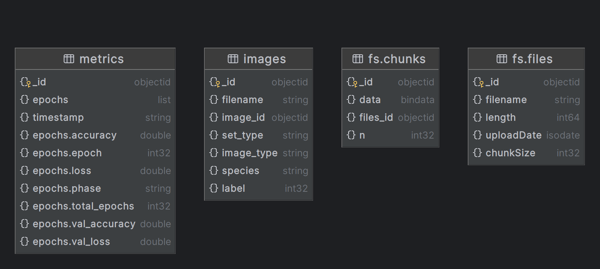
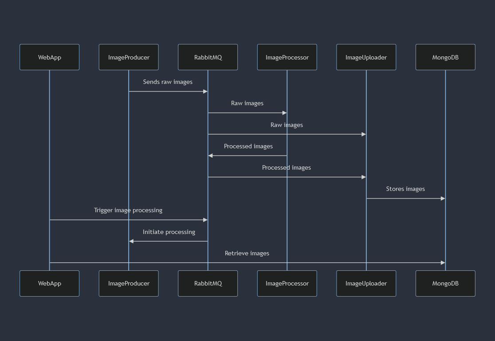
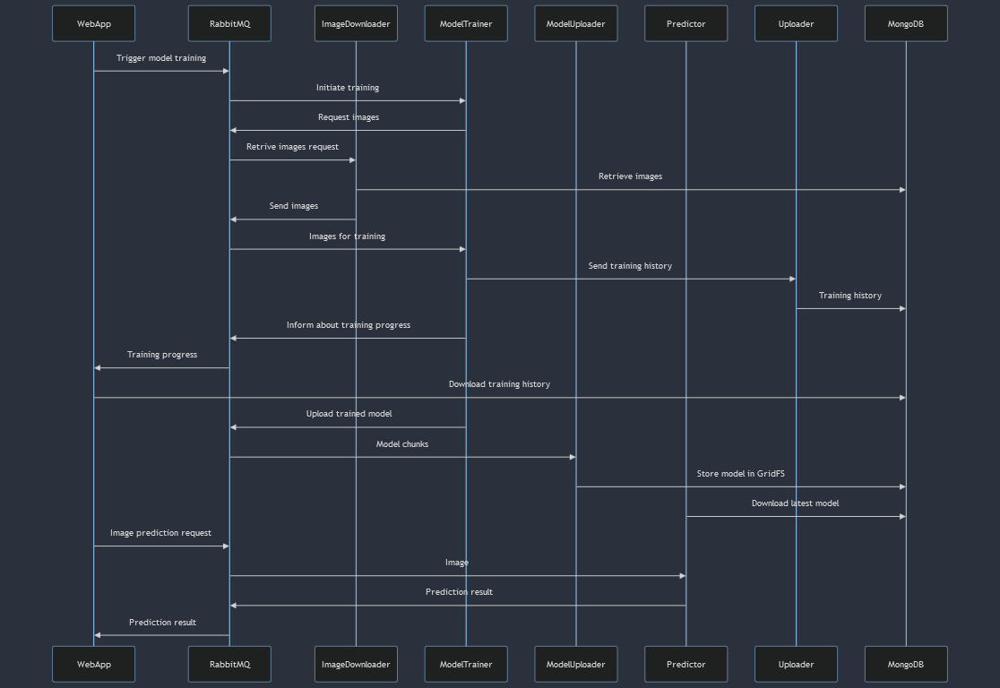
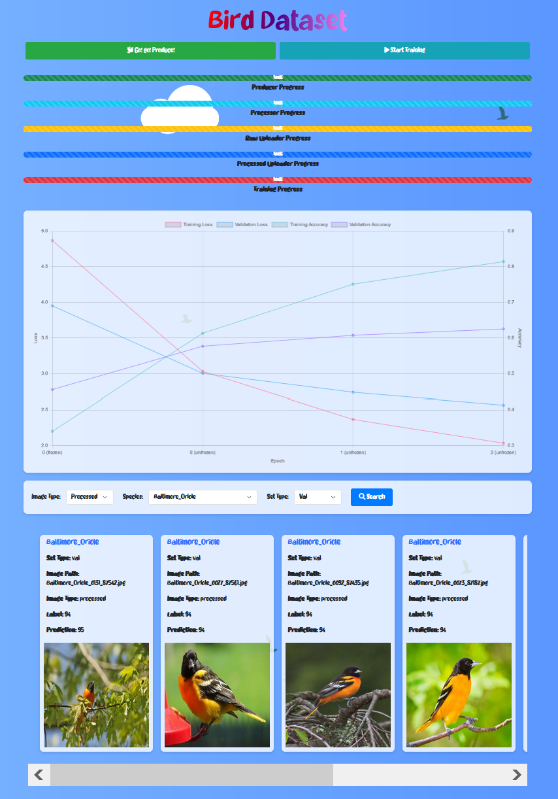

# add_project

we use CUB-200-2011 (Caltech-UCSD Birds-200-2011)
https://paperswithcode.com/dataset/cub-200-2011

## Overview

This project involves the use of a bird dataset to train a machine learning model for bird species classification. The workflow includes image processing, model training, and prediction phases. Below are detailed descriptions of the database schema and the overall system architecture.

## Database Schema

The following diagram illustrates the database schema used to store metrics, images, and files.

- **metrics**: Stores training metrics such as accuracy, loss, and timestamp.
- **images**: Contains information about images, including filenames, species, and labels.
- **fs.chunks**: Stores binary data chunks for larger files.
- **fs.files**: Metadata for files stored in the database.

## Image Storage

This diagram represents our dataset used for storing images in MongoDB. Each image is associated with metadata including its filename, species, and label.

## Image Processing

The image processing pipeline involves several steps:
1. **WebApp** triggers image processing.
2. **ImageProducer** sends raw images to RabbitMQ.
3. **RabbitMQ** queues raw images for processing.
4. **ImageProcessor** processes raw images and sends them back to RabbitMQ.
5. **ImageUploader** retrieves processed images and stores them in MongoDB.

## Model Training

The model training process includes:
1. **WebApp** initiates model training.
2. **ImageDownloader** requests images for training.
3. **ModelTrainer** trains the model using the retrieved images.
4. **ModelUploader** uploads the trained model in chunks to GridFS in MongoDB.
5. **Predictor** uses the trained model to make predictions.

## Services

This project utilizes several services to achieve the desired functionality:
- **WebApp**: User interface for triggering image processing and model training.
- **RabbitMQ**: Messaging broker for queuing tasks.
- **MongoDB**: Database for storing images and training metrics.
- **ImageProducer, ImageProcessor, ImageUploader, ImageDownloader, ModelTrainer, ModelUploader, Predictor**: Various components involved in processing images and training the model.

## WebApp

